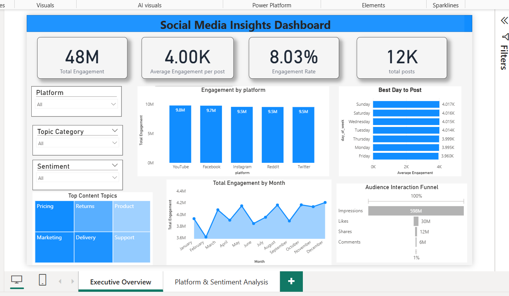

# 📊 Social Media Insights Dashboard

## 📌 Project Overview
Analyzes social media engagement across multiple platforms to identify top-performing content, peak engagement times, and audience interaction trends. Using SQL and Power BI, raw post-level data is converted into actionable business insights.

## 🎯 Business Problem
Social media teams often struggle to:
- Identify high-performing platforms
- Discover content that drives engagement
- Optimize posting times for maximum reach

This dashboard centralizes engagement metrics to solve these challenges.

## 🛠️ Tools & Technologies
- **Power BI:** Data modeling, DAX measures, interactive dashboards  
- **SQL:** Aggregations, grouping, analytical queries  
- **CSV Dataset:** Post-level social media engagement data  
- **GitHub:** Version control and documentation  

## 📂 Project Structure
social-media-insights-dashboard/
│
├── sql/ # SQL analysis scripts
│ └── engagement_analysis.sql
├── data/ # CSV data
│ └── social_media_data.csv
├── images/ # Dashboard images
│ └── final_dashboard.png
├── powerbi/ # Power BI file
│ └── Social_Media_Insights.pbix
└── README.md

## 📈 Key Metrics (KPIs)
- **Total Engagement**  
- **Average Engagement per Post**  
- **Engagement Rate (%)** = (Total Engagement / Total Impressions) * 100  
- **Total Posts**  

## 📊 Dashboard Features
**Platform Analysis**
- Engagement by Platform  
- Engagement Contribution  

**Content Analysis**
- Top Viral Posts  
- Top Content Topics  
- Engagement by Sentiment  

**Time Analysis**
- Monthly Engagement Trend  
- Best Day to Post  

## 🧠 Key Insights
- Certain platforms consistently outperform others  
- Positive sentiment posts generate higher interaction  
- Posting on specific days boosts reach  
- A small set of topics drives most user engagement  

## 🚀 How to Use
1. Clone or download the repository  
2. Ensure Power BI Desktop is installed  
3. Open `Social_Media_Insights.pbix`  
4. Refresh the dataset (if needed)  
5. Explore insights using slicers and visuals  

## 👤 Author
**Mayur Bende**  
Aspiring Data Analyst | SQL | Power BI | Data Visualization  
[LinkedIn](https://www.linkedin.com/in/mayur-bende/) | [GitHub](https://github.com/mayurbende607)

